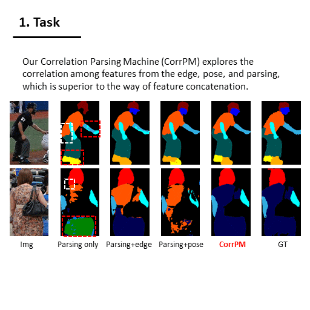

# Correlating Edge, Pose with Parsing

This is a Pytorch implementation of our paper [Correlating Edge, Pose with Parsing](https://openaccess.thecvf.com/content_CVPR_2020/papers/Zhang_Correlating_Edge_Pose_With_Parsing_CVPR_2020_paper.pdf) accepted by CVPR2020. We propose a Correlation Parsing Machine (CorrPM) utilizing a Heterogeneous Non-Local (HNL) network to capture the correlations among features from human edge, pose and parsing.

<div align="center">
    
</div>

## Requirements
Pytorch 0.4.1

Python 3.6

The compile of InPlace-ABN is based on [CE2P](https://github.com/liutinglt/CE2P).

## Implementation
### Dataset
Please download [LIP](http://sysu-hcp.net/lip/overview.php) dataset and make them follow this structure:
```
|-- LIP
    |-- TrainVal_pose_annotations/LIP_SP_TRAIN_annotations.json
    |-- images_labels
        |-- train_images
        |-- train_segmentations
        |-- val_images
        |-- val_segmentations
        |-- train_id.txt
        |-- val_id.txt
```


Pose annotation file can be downloaded here [Google drive](https://drive.google.com/open?id=1IGehIsLPyPTY9CHWSkugMQvPYw60cBLT).

### Train and Test
The pre-trained ResNet-101 can be downloaded from [Google drive](https://drive.google.com/open?id=1uTf0wNLS5y0l8jIy06Tewdg8XF0TMSOq) or [Baidu drive](https://pan.baidu.com/s/1Lzjvqpafw9VUO45TcPvhBA).

```bash
./run_train.sh
```

Please download our trained model from [Google drive](https://drive.google.com/open?id=1skvx6qVjh31a0Bff6ad06I82jRTtO-1T) or [Baidu drive](https://pan.baidu.com/s/1XEXfR7--9eqUIn_LnJTlYA) and put it in the ```./pth``` folder.

```bash
./run_eval.sh
```

## Citation
If you use this code for your research, please cite our papers.
```
@InProceedings{Zhang_2020_CVPR,
author = {Zhang, Ziwei and Su, Chi and Zheng, Liang and Xie, Xiaodong},
title = {Correlating Edge, Pose With Parsing},
booktitle = {IEEE/CVF Conference on Computer Vision and Pattern Recognition (CVPR)},
month = {June},
year = {2020}
}
```
